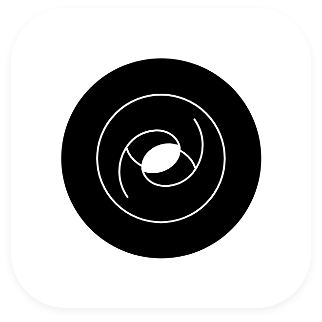

<h1 align="canter"></h1>
 

   

# Personal Portfolio Website 

A personal portfolio allows each individual to put a personal touch and emphasis on their journey, personality, and to highlight the pieces of work that are important to them and reflects who they are.

In accordance with this, my portfolio is a way to express my passion for art and technology.  It's because of my love for clean design and minimalistic perspectives that I put together a portfolio that encompasses the use of cutting-edge technology and minimalistic design. 
 
